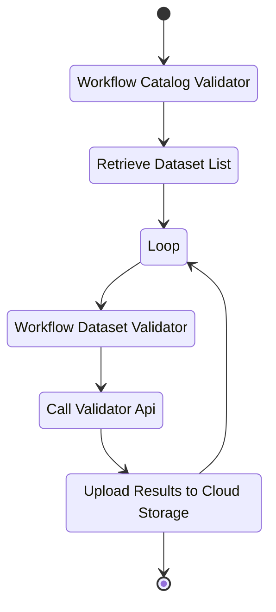

# GBFS Datasets Metrics(POC)

This work is a Proof of Concept on data pipeline to obtain GBFS datasets validation reports metrics. This project setup the requirements infrastructure to process the GBFS metrics based on [GCP workflow](https://cloud.google.com/workflows).

## Current Limitation

GCP workflows limits the amount of memory each workflow can hanle, 512KB. This memory limitation impacts the long API responses. 
To overcome this limitation the API services should return the minimum body and leave the worflow only an orchestration role.

# Requirements 

- GCloud account and project
    - Signup for a GCloud account
    - Create GCloud project
    - Install GCloud CLI, https://cloud.google.com/sdk/docs/install
    - Authenticate to GCloud, below find the most common method
    ```
        gcloud auth application-default login
    ```

- Terraform CLI
    - Follow documented installation process at https://developer.hashicorp.com/terraform/cli

# Terraform deployments execution

- Local variables 
    - Rename file `vars.tfvars-rename-me` to `vars.tfvars`
    - Assign variables pointing to your GCP and validator environments
- Check the terraform plan
    ```
        terraform plan -var-file="vars.tfvars"
    ```
- Apply the terraform plan
    ```
        terraform apply -var-file="vars.tfvars"
    ```

# Executing GCP Workflow

Execute `workflow-gbfs-catalog-validator` workflow via command line or GCP console.

# Data Pipeline Workflow

Below is a simplified version of the design, including all workflows and ignoring error scenarios for a high-level understanding.



# Useful commands

- BigQuery transfer job logs
```
bq show --format=prettyjson -j {JOB_ID}
```
